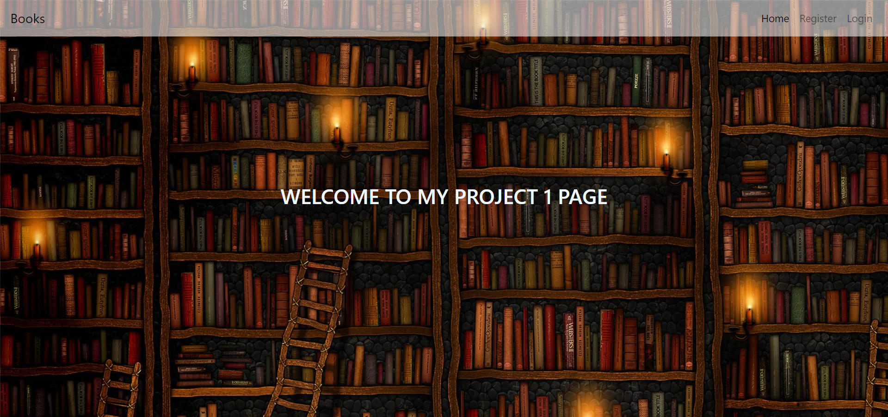

# Project 1

Web Programming with Python and JavaScript

Breif description: This is a simple book review app made with flask. To use this website features you have to login first. Anyone can register in this website. After registration and logged into the website people can search for books, view reviews on particular book and can submit his own review.

Features:
Login: If user go to root url first it will check if the user is already signed in or not using the session. If not then app will show the login page otherwise app will take the user to the account page without asking him to login everytime. When login page apprears and user input his email and password - app will compare the informations with informations that are already saved in database. If the username and password match then user wiil be logged in and allowed to go to account page otherwise error message will show.

Registration: New user can register on the website. Before registration app will check if there is already any account registered with the same email. If no account found than app will register the account in the website.

Logout: Users can log out from the website by clicking on the logout button.

Search: By clicking the search menu button Users can search books by Title or Author or Year or ISBN number. If user submit the keyword in the search bar a search result table will appear with book list with that information.

Book page: By clicking a book title from the search result users can view information about that book. Statical information will come from goodread.com api and reviews data will come from my website database.

